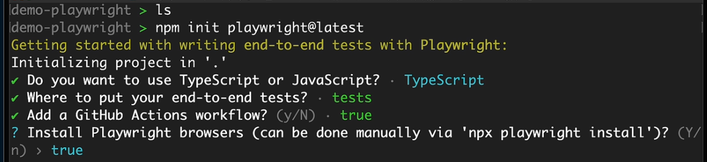
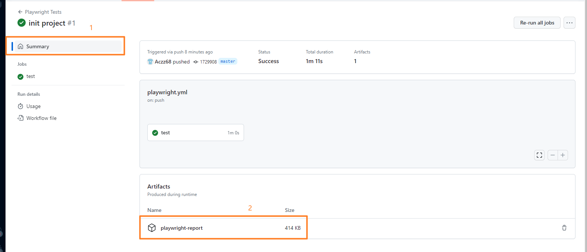
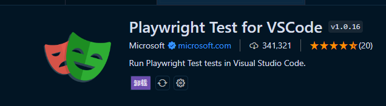

# 主要模块

- 主要概念

- 安装

- 配置

- 使用情况

## 模板演示



### 启动

```bash
### 基础
npm init vite demo-app-playwright #创建测试demo
npm init playwright@latest #安装playright
npx playwright install #安装playwright中的浏览器内核
npx playwright test #开始执行测试文件中的测试
npm playwright test xx.spec.ts --trace on #开启追踪设置

### 可将其添加进脚本
(test)npx playwright test google --reporter=list #查看详细列表信息
(test-chrome)npm run test -- --project=chromium #在底层逻辑上使用

npx playwright test google --reporter=list --project=chromium #指定使用内核
npx playwright test google --reporter=list --project=chromium --headed #直接在浏览器中运行

### 扩展
npm playwright show-report #启动网络服务器,并在浏览器中打开报告

### vrt测试
npm run test -- vrt #使用vrt测试
npm run test -- vrt --update-snapshots #更新快照,将简单的用生成的新图像替换现有的图像

### debug模式
npm run test -- inspector.spec.ts(文件名) --debug

### 开启命令行工具
# 在codegen 模式下启动检查器
npx playwright codegen -o tests/codegen.spec.ts
npx playwright test tests/codegen.spec.ts --headed #配合playwright使用
# 注意:会模拟一系列操作


```

### 上传到 github

- 步骤一:添加到缓存
- 步骤二:Commit 到缓存
  - 选择私有或公有(private(私有)&public(公共))
- 步骤三:打开 github
  - 进行报告的下载
  - 

### 下载 playwright 扩展

1. 搜索[playwright Test for VSCode]



### 将 playwright 安装到项目中

```js
npm init vite demo-app-playwright
npm init playwright

// 在playwright.config.ts 中使用网络服务器
() {
  webServer:{
    command:'npm run dev',
    url:'http://localhost:5173'
  }
}
```

## 文件夹介绍

1. [tests]文件中包含测试文件
2. [playwright.config.ts]
   1. 设置测试文件路径
   2. 设置可加载的浏览器
3. [github]github 操作使用,便于 github 上执行测试(多人测试)

## vscode

1. Playwright Test for VSCode(安装 TS 的扩展)

## 注意

await 使用可允许暂停测试的执行,直到特定条件得到满足

## 英文

```js
// arrange(筹备)
// act(行为)
// assert(断言)
```

### example 预期

可预期页面应该有一个特定的标题

### spec 规格
