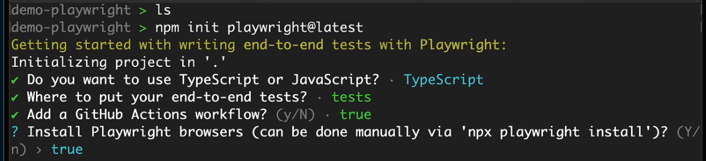
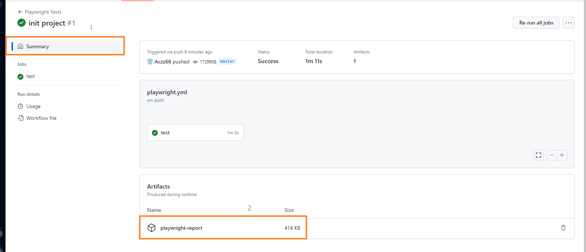

# 主要概念

- 主要概念

- 安装

- 配置

- 使用情况

## 模板演示



### 启动

```bash
npx playwright test # 开始执行测试文件中的测试
npx playwright show-report # 启动网络服务器,并在浏览器中打开报告
```

### 上传到 github

- 步骤一:添加到缓存
- 步骤二:Commit 到缓存
  - 选择私有或公有(private(私有)&public(公共))
- 步骤三:打开 github
  - 进行报告的下载
    

### 下载 playwright 扩展

1. 搜索[playwright Test for VSCode]


## 文件夹介绍

1. [tests]文件中包含测试文件
2. [playwright.config.ts]
   1. 设置测试文件路径
   2. 设置可加载的浏览器
3. [github]github 操作使用,便于 github 上执行测试(多人测试)

## vscode

1. Playwright Test for VSCode(安装 TS 的扩展)

## 注意

await 使用可允许暂停测试的执行,知道特定条件得到满足

## 英文

### example 预期

可预期页面应该有一个特定的标题

### spec 规格
